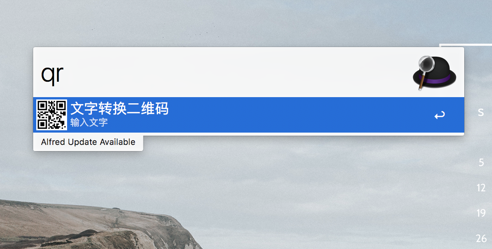

## Use
运行`qrcode.alfredworkflow`文件

## todoList
* 复制图片

## 参考资料
* [Workflows](https://www.alfredapp.com/help/workflows/);
* [node API](http://nodejs.cn/api/);
* [CodeVar](https://github.com/xudaolong/CodeVar);
* [alfy](https://github.com/sindresorhus/alfy);
